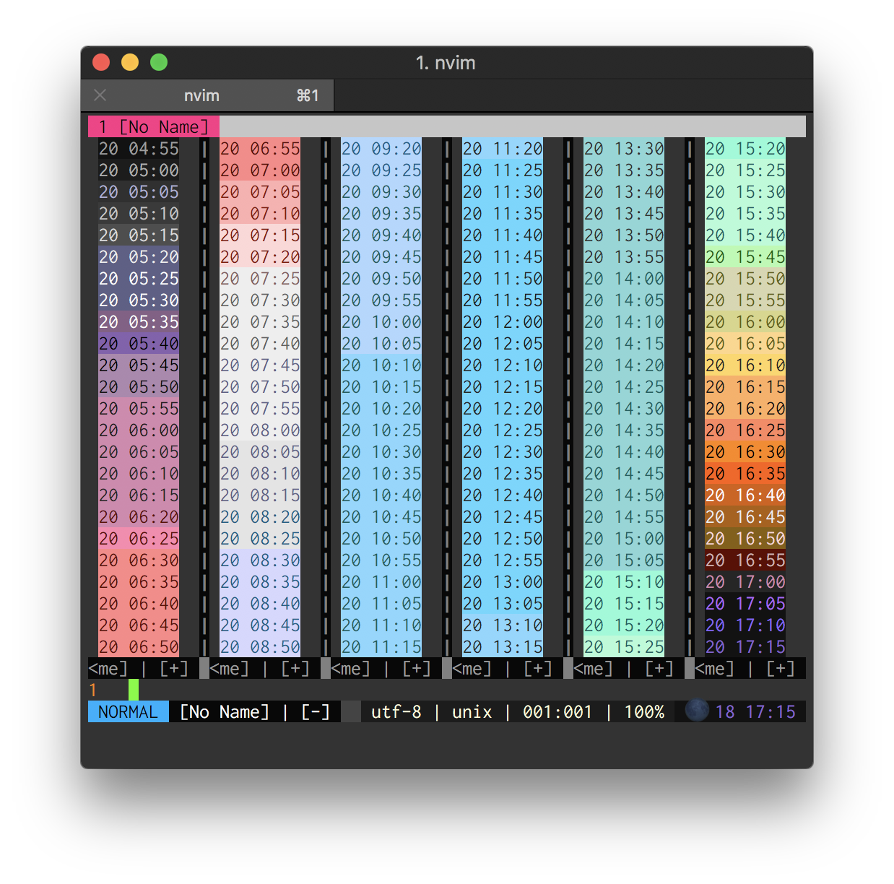
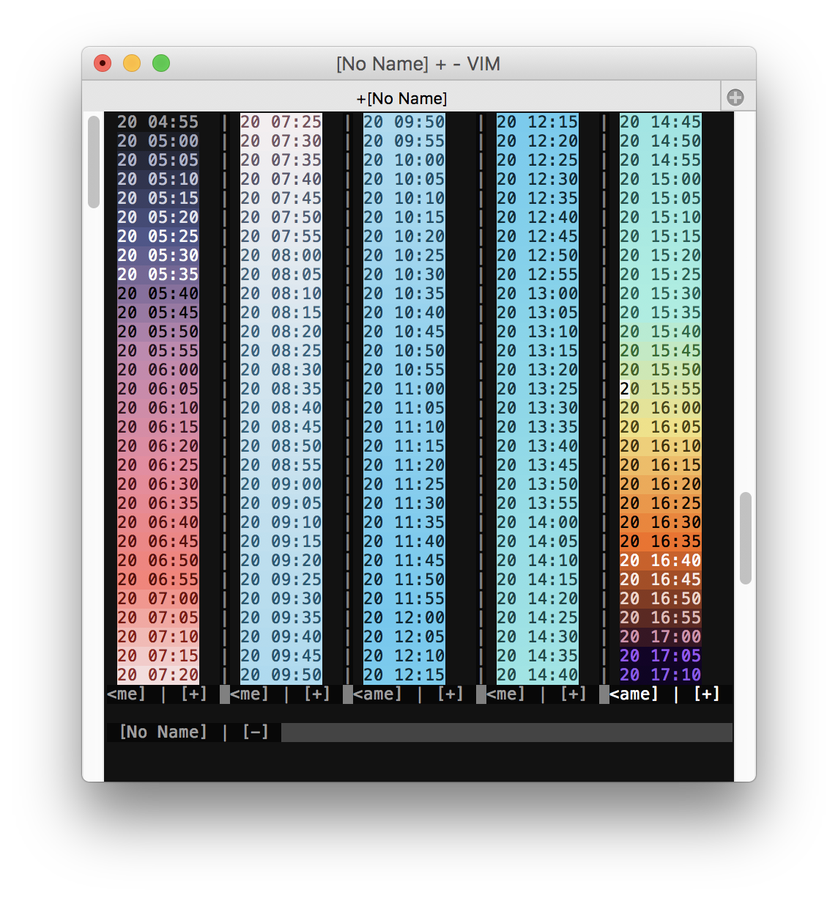

## sky-color-clock.vim
This plugin is inspired by [zk-phi/sky-color-clock: [Emacs] A clock widget for modeline with sky color at the time and moonphase icon](https://github.com/zk-phi/sky-color-clock).  
Great, thanks to [zk-phi](https://github.com/zk-phi) !

## Examples
For terminal.



For graphical.



## Feature
- [X] A clock widget for statusline with sky color at the time.
- [X] Moonphase emoji

## installation
```vim
call dein#add('mopp/sky-color-clock.vim')

" set statusline to enable this plugin.
set statusline+=%#SkyColorClockTemp#\ %#SkyColorClock#%{sky_color_clock#statusline()}

" For lightline.vim
let g:lightline = {
            \ 'component': {
            \   'sky_color_clock': "%#SkyColorClock#%{' ' . sky_color_clock#statusline() . ' '}%#SkyColorClockTemp# ",
            \ },
            \ 'component_raw': {
            \   'sky_color_clock': 1,
            \ },
            \ }

" You can preview the datetimes and colors.
call sky_color_clock#preview()

" For only test
let g:sky_color_clock#timestamp_force_override = 1516201200 + 12 * 60 * 60 " 12:00:00

" Configure variables.
let g:sky_color_clock#latitude
let g:sky_color_clock#color_stops
let g:sky_color_clock#datetime_format
let g:sky_color_clock#enable_emoji_icon
let g:sky_color_clock#openweathermap_api_key " or export OPENWEATHERMAP_API_KEY='hogehoge'
let g:sky_color_clock#openweathermap_city_id
let g:sky_color_clock#temperature_color_stops
```
